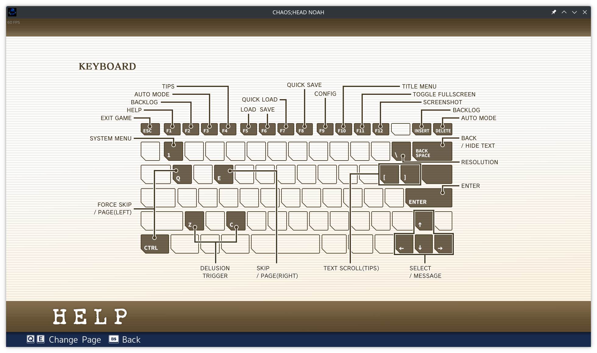

# Science Adventure Linux Keybindings

This repo is based on three assumptions:

  1. That you are playing a [Science Adventure](https://en.wikipedia.org/wiki/Science_Adventure) title **on Linux** and are dissatisfied with the nonsensical in-game keybindings;
  1. that you have [Map2](https://github.com/shiro/map2) by [shiro](https://github.com/shiro) installed on your system; which, in turn, assumes
  1. that you are using X11, since Map2 does not look like it will implement Wayland compatability in the forseeable future.

This project was initially made with Chaos;Head in mind, so for the time being the keybindings will be more specific to that game. Optimal bindings for other games may be added over time, and if not it should be easy enough to adapt the m2 script.

If you are using this for some other purpose, that's wonderful! It's a very flexible script, and I quite like it. But do keep in mind that it's not what this was made for and that you probably won't get very active support for issues that may arise.

## Table of Contents

  1. [Introduction](#introduction)
  1. [Setup](#setup)
      1. [The Game's Window Class](#the-games-window-class)
      1. [devices.list](#deviceslist)
  1. [Usage](#usage)
      - [Default Rebinds](#default-rebinds)

## Introduction

The following are the default keyboard controls for [CHAOS;HEAD NoAH](https://store.steampowered.com/app/1961950/CHAOSHEAD_NOAH/), the latest entry to release on Steam.



In my humble opinion, this is no way to live. There is no discernable rhyme or reason to which buttons map to what game functions, and there is no in-game method to rebind any of these keys in C;H or in succeeding titles (to my knowledge. I have only played Steins;Gate, and rebinding functions were absent in that game as well).

Fortunately, there are benefits to being a Linux dweeb. The aforementioned Map2 program allows us not only to rebind keys to an arbitrary amount of keystrokes, but also to do so within certain window contexts. We can thus make a script which only rebinds keys when switching to a game window and then unbinds them upon clicking away.

## Setup

A small amount of setup is required to get this working. It's nothing too fancy, and it only has to be done once. Probably. I haven't actually tried resetting my computer since making this script.

### The Game's Window Class

Map2 allows for checking the name of the "active window class", which is essentially the name of the window you have focused. Combined with conditional branching, this lets us only rebind keys when on certain steam games.

As the user, all you have to do is change the value of the variable `game_windowclass` on the first line of the m2 script:

```
let game_windowclass = "<game window class>";
```

For Steam games, at least on Proton, this appears to follow the simple pattern of `steam_app_<App ID>`. For example, the window class for C;H is `steam_app_1961950` and is the default value in the script. Below is a table with the class names of every currently released SciAdv game on Steam, which I adapted (shamelessly ripped) from the [Committee of Zero](https://sonome.dareno.me/)'s [Multiversal Linux Patcher](https://github.com/CommitteeOfZero/multiversal-coz-linux-patcher#running-the-multiversal-patcher). Otherwise, if you for some reason don't immediately know the App ID of every Steam game ever made off the top of your head, you can check on [SteamDB](https://steamdb.info/) or with `protontricks -s <game title/substring>` if you have that installed.

| **Game**              | **Window Class Name**    |
| ----------------      | ------------------       |
| CHAOS;HEAD NoAH       | `steam_app_1961950`      |
| STEINS;GATE           | `steam_app_412830`       |
| ROBOTICS;NOTES ELITE  | `steam_app_1111380`      |
| CHAOS;CHILD           | `steam_app_970570`       |
| STEINS;GATE 0         | `steam_app_825630`       |
| ROBOTICS;NOTES DaSH   | `steam_app_1111390`      |

That should be sufficient, but if you want to be super-*duper* sure then you can use the nifty command `xdotool getactivewindow getwindowclassname`, which prints out the class name of the currently active window. Since it does so immediately, you can throw in a delay like `sleep 2 && xdotool getactivewindow getwindowclassname`, click on your window of interest, and then have it print out, replacing `2` with however long it takes for you to navigate to your window of interest. This is actually how I first discovered Steam's class window naming convention.

### devices.list

Map2 must be informed of which device to intercept inputs from (i.e., your keyboard). This comes in the form of a path within `/dev/input/`, which is then pasted into `devices.list`. There are undoubtedly several ways to find this path, some of which are likely better than what is described here, but I will share what worked for me.

A good starting point is the command `xinput list`: this will bring up a list of virtual devices that X11 is currently using to accept input, and the device names are quite self-explanatory. Running this on my setup gives the following.

```
$ xinput list
⎡ Virtual core pointer                          id=2    [master pointer  (3)]
⎜   ↳ Virtual core XTEST pointer                id=4    [slave  pointer  (2)]
⎜   ↳ Logitech ERGO K860                        id=13   [slave  pointer  (2)]
⎜   ↳ Logitech MX Vertical                      id=15   [slave  pointer  (2)]
⎜   ↳ Logitech MX Vertical Advanced Ergonomic Mouse Keyboard    id=8    [slave  pointer  (2)]
⎜   ↳ Logitech MX Vertical Advanced Ergonomic Mouse     id=10   [slave  pointer  (2)]
⎜   ↳ Sony Interactive Entertainment Wireless Controller Touchpad       id=11   [slave  pointer  (2)]
⎣ Virtual core keyboard                         id=3    [master keyboard (2)]
    ↳ Virtual core XTEST keyboard               id=5    [slave  keyboard (3)]
    ↳ Power Button                              id=6    [slave  keyboard (3)]
    ↳ Power Button                              id=7    [slave  keyboard (3)]
    ↳ Logitech Webcam C925e                     id=12   [slave  keyboard (3)]
    ↳ Logitech ERGO K860                        id=14   [slave  keyboard (3)]
    ↳ Logitech MX Vertical                      id=16   [slave  keyboard (3)]
    ↳ Logitech MX Vertical Advanced Ergonomic Mouse Keyboard    id=9    [slave  keyboard (3)]
```

Ignoring outdated naming conventions and the fact that I'm apparently a Logitech fanboy, we can immediately see that it separates the mouse and keyboard into separate virtual devices with logical IDs for its components. In this case, the model name for my Logitech ERGO K860 can be found under the "Virtual core keyboard" with ID 14. This is the ID that we will use for the next step.

Passing an ID of 14 to `xinput list-props` gives the following:

```
$ xinput list-props 14
Device 'Logitech ERGO K860':
        Device Enabled (163):   1
        Coordinate Transformation Matrix (165): 1.000000, 0.000000, 0.000000, 0.000000, 1.000000, 0.000000, 0.000000, 0.000000, 1.000000
        libinput Send Events Modes Available (277):     1, 0
        libinput Send Events Mode Enabled (278):        0, 0
        libinput Send Events Mode Enabled Default (279):        0, 0
        Device Node (280):      "/dev/input/event4"
        Device Product ID (281):        1133, 16520
```

And this gives us our answer: the line `Device Node (280): "/dev/input/event4"` tells us that my keyboard is using device file `/dev/input/event4`. All that remains is a one-line `echo '/dev/input/event4' > devices.list`, and Map2 now knows which device to poll!

For more details on `devices.list`, you can consult [the Map2 repo itself](https://github.com/shiro/map2#getting-started). You can add as many devices as you want for rebinding inputs, and supposedly you can find more descriptive device filenames within `/dev/input/by-path/` and `/dev/input/by-id/`. I had no such luck, so I simply described here what worked for me.

## Usage

Now the easy part! If you are perfectly fine with all of my keybinding decisions and/or don't want anything to do with customization, the process is as easy as running the provided `./rebind`, playing the game, and stopping the script with `CTRL+C` once you've finished.

### Default Rebinds

Below is a table containing the default key rebinds provided by this script. Most of these I determined by just choosing the first letter of their function; luckily this turned into a somewhat well-formatted control scheme with most of the buttons ending up on the left side of the keyboard. Reasoning for others can be found in the notes.

| **Game Function**              | **Rebound Key** | **Original Key** | **Notes**                                                                      |
|--------------------------------|-----------------|------------------|--------------------------------------------------------------------------------|
| Exit game                      | End             | Escape           | Escape is so commonly a pause/menu button, and I almost never use the End key. |
| Help                           | /               | F1               | I thought of it as '?' without the shift.                                      |
| Backlog                        | B               | F2               |                                                                                |
| Auto mode                      | A               | F3               |                                                                                |
| Tips                           | T               | F4               |                                                                                |
| Load                           | L               | F5               |                                                                                |
| Save                           | S               | F6               |                                                                                |
| Quick load                     | Alt+L           | F7               |                                                                                |
| Quick save                     | Alt+S           | F8               |                                                                                |
| Config                         | C               | F9               |                                                                                |
| System menu                    | Escape          | 1                | Whose idea was this idea                                                       |
| Back / Hide text               | Tab             | Backspace        | Jives with the *ergonomics* of the other choices                               |
| Text scroll up (tips, backlog) | K               | [                | I believe in Vim supremacy                                                     |
| Text scroll down               | J               | ]                | ^C ^C ^C ^C                                                                    |
| Left delusion trigger          | [               | Z                |                                                                                |
| Right delusion trigger         | ]               | C                |                                                                                |

Do note that the default keys have *not* been actively unbound, so pressing Q will still toggle force skip and make you miss juicy dialogue that you may not have yet seen.

## Customization

\- to be added, i'm very tired and just wanna read noah \-
